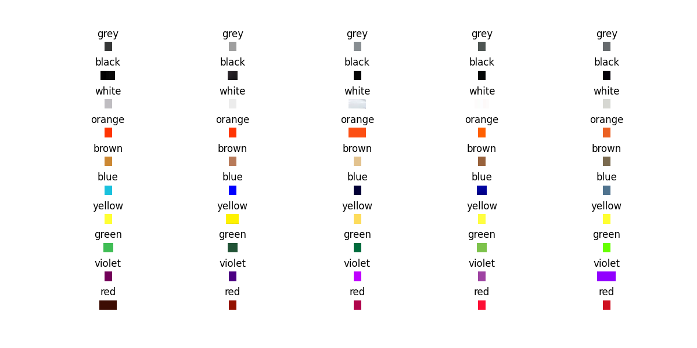
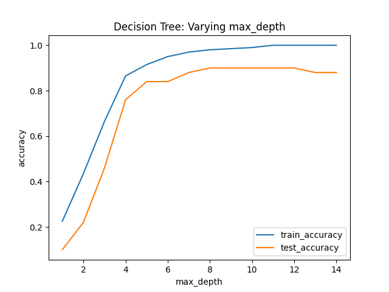
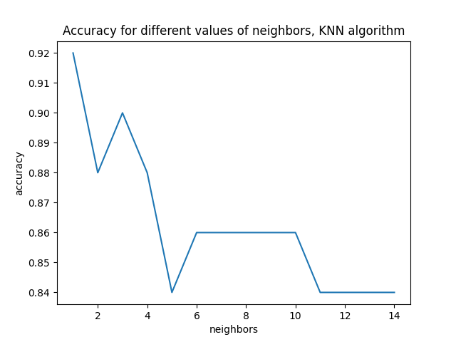

# Color Detection Software Documentation

## Introduction
The Color Detection Software is a tool developed for our project aimed at detecting the color of bioindicators based on the RGB value of an image. The software utilizes two machine learning models: Decision Trees and K-Nearest Neighbors (KNN). This documentation provides an overview of the software, its functionality, and the process of developing and improving it.


*Figure 1: Sample images processed by the Color Detection Algorithms

## Table of Contents
1. **Getting Started**
    - Prerequisites
    - Installation
    - Use the model
2. **Data Collection**
    - Folder Structure
    - Image Selection
3. **Data Preprocessing**
    - Extracting RGB Values
    - Data Labeling
4. **Machine Learning Models**
    - Decision Tree Classifier
    - Model Evaluation
    - K-Nearest Neighbors Classifier
5. **Model Comparison**
    - Performance Metrics
    - Accuracy Visualization
6. **Model Deployment**
    - Saving the Model
7. **Conclusion**
    - Project Summary
    - Future Improvements

## 1. Getting Started
### 1.1 Prerequisites
- Python 3.x
- OpenCV (cv2)
- Pandas
- NumPy
- Matplotlib
- Scikit-learn

### 1.2 Installation
Install the required libraries using pip:
```bash
pip install opencv-python pandas numpy matplotlib scikit-learn
```

### 1.3 Use the model
To use the model, load the `color_detection_model.pkl` file using the Pickle library:
```python
import pickle

model = pickle.load(open('color_detection_model.pkl', 'rb'))
```
Then, use the `predict` function to predict the color of an image:
```python
model.predict([[255, 255, 0]])
# Output: array([6])

# Or read the rgb values using cv2

import cv2

img = cv2.imread('image.jpg')
rgb = cv2.cvtColor(img, cv2.COLOR_BGR2RGB)
rgb = (image[0][0])
model.predict([rgb])
```
The model returns a numerical value representing the color category. The color categories are as follows:

#
- 0: Grey
- 1: Black
- 2: White
- 3: Orange
- 4: Brown
- 5: Blue
- 6: Yellow
- 7: Green
- 8: Violet
- 9: Red

## 2. Data Collection
### 2.1 Folder Structure
The software expects a structured dataset located in a folder called 'training_dataset.' Inside this folder, each subfolder represents a different color category, and it contains images of that color.

### 2.2 Image Selection
For higher training accuracy, the number of images under each color category should be the same or roughly the same.

## 3. Data Preprocessing
### 3.1 Extracting RGB Values
The software extracts the RGB values from each image using the cv2 library. The RGB values are stored in a Pandas DataFrame.

### 3.2 Data Labeling
The color categories are labeled numerically using the `factorize` function from Pandas.

## 4. Machine Learning Models
### 4.1 Decision Tree Classifier
A Decision Tree Classifier is trained on the dataset with different `max_depth` values to determine the optimal tree depth. The accuracy of the model is evaluated using a test dataset.

### 4.2 K-Nearest Neighbors Classifier
A K-Nearest Neighbors (KNN) Classifier is trained on the dataset with varying numbers of neighbors. The 'distance' metric and 'euclidean' distance measure are used. The accuracy of the KNN model is also evaluated.

## 5. Model Comparison
### 5.1 Performance Metrics
Both Decision Tree and KNN models are evaluated using the accuracy metric, which measures the proportion of correctly classified samples.

### 5.2 Accuracy Visualization
The software generates accuracy vs. parameter plots to visualize the performance of both models and help determine the best model for the task.


*Figure 2: Decision Tree Accuracy Plot*


*Figure 3: KNN Accuracy Plot*

## 6. Model Deployment
The final KNN model with the highest accuracy is saved using the Pickle library as 'color_detection_model.pkl.'

## 7. Conclusion
After exploring two machine learning models, Decision Trees and K-Nearest Neighbors, the KNN model achieved the highest accuracy (92%) and was chosen for deployment. Future improvements could include fine-tuning the model and expanding the dataset for more accurate detection.

This software serves as a valuable tool for color-based bioindicator detection and can be further enhanced to support a wider range of applications.

